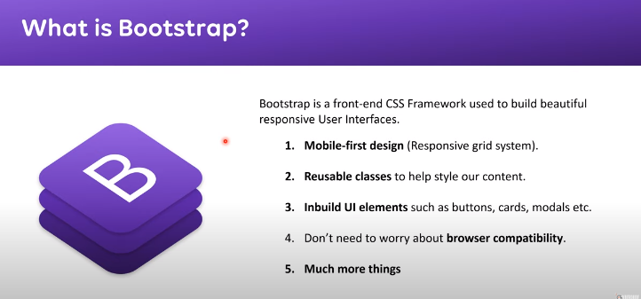

- how to toggle wordwrap for big links in html?
    - 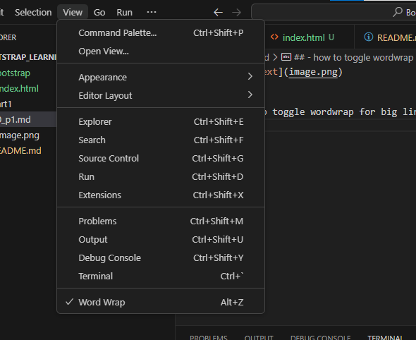
    - Alt + z  (or)
    - click  on view  in vscode and select wordwrap

- Just by adding the CDN link , the  webpage  lookchanges a little  bit

- in css , if you type `bgc` it will show `background-color` in the suggestion
- other suggestions are
    - `bgc` -> `background-color`
    - `bgi` -> `background-image`
    - `bgr` -> `background-repeat`
    - `bgs` -> `background-size`
    - `bga` -> `background-attachment`
    - `bgo` -> `background-origin`
    - `bgp` -> `background-position`

- hr tag is used to create a horizontal line

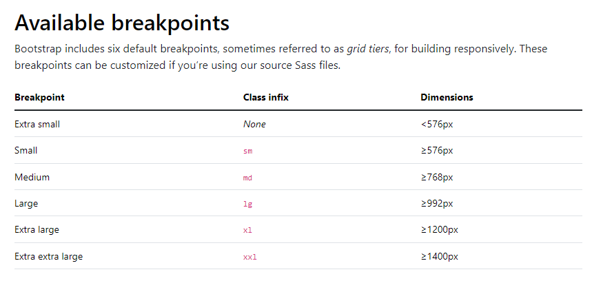

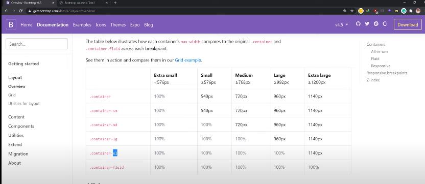

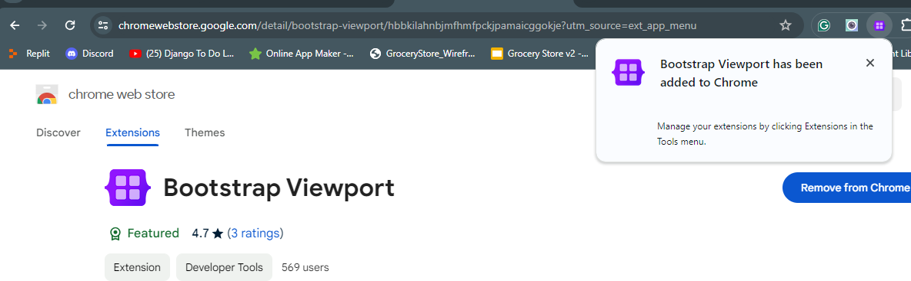

- add the  chrome extension `bootstrap viewport` to see the website in different devices

- container vs container-fluid
    - container
        - it has a fixed width
        - it is used to create a responsive website
    - container-fluid
        - it takes the full width of the screen
        - it is used to create a full width website
    - container-md
        - this will add padding ,  once the screen size is medium or above
        - if we give normal container , the padding will be there for all the screen sizes except xs

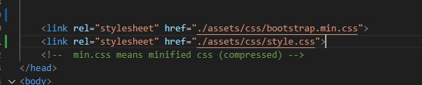
- Note : order of css files is important
    - if we give `bootstrap.min.css` first and then `style.css` , the `style.css` will override the `bootstrap.min.css`

- https://stackshare.io/tech-stack-file
    - website where you can see various tech stacks used by various companies

👉 Bootstrap Documentation (https://getbootstrap.com/docs/4.5/lay...)
👉 Bootstrap Viewport (Extension) (https://chrome.google.com/webstore/de...)
👉 Bootstrap Grid Overlay (Extension) (https://chrome.google.com/webstore/de...)
👉 Bootstrap Grid GUI Tool (http://shoelace.io/)

- in bootstrap grid, all the content is divided into 12 columns
    - so upon building the website, we can divide the content into 12 columns

- bootstrap is built over flexbox
    - so we can use flexbox properties in bootstrap
    - for example, we can use `justify-content-center` to center the content
    - we can use `align-items-center` to center the content vertically  in the container
    - we can use `d-flex` to make the container as flex container
    - we can use `flex-column` to make the container as column flex container
    - flexbox properties are used to align the content in the container
        - `justify-content-center` -> to align the content horizontally

- css flex box is a pre requisite for this  video, so 
    - https://youtube.com/watch?v=LkBlhvg2hqI
        - watch this video to understand flexbox
        - git link for the video is 
            - https://github.com/anburocky3/CSS3-from-scratch-cyberdude/blob/31-CSS-Flexbox/css/style.css
    - flex box is 2d  whereas grid is 3d with a z axis
    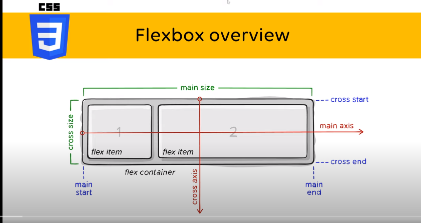
    - 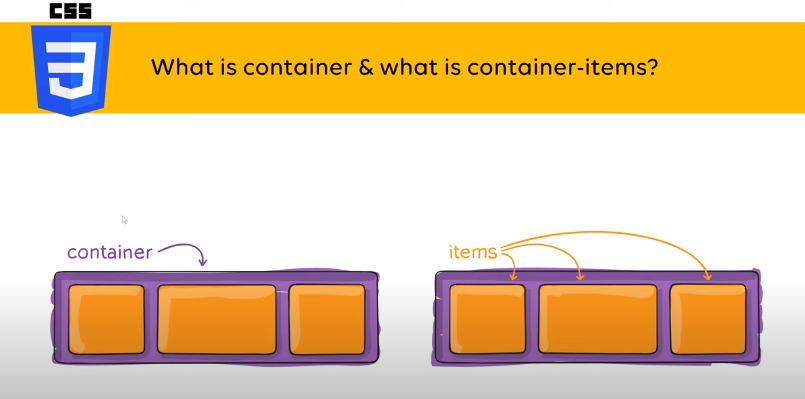
    - flexbox  properties
        - 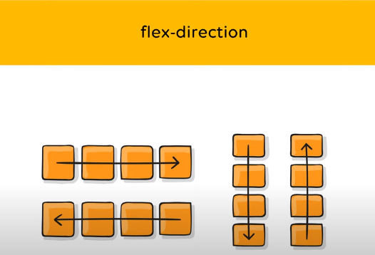
            - flex-direction
                - left and right
                - top and bottom
        - flex wrap 
            - 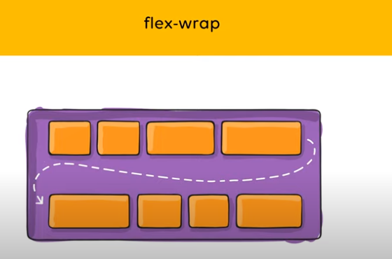
            - it is used to wrap the content
            - if we give `flex-wrap: wrap` , the content will wrap to the next line
        - justify-content
            - 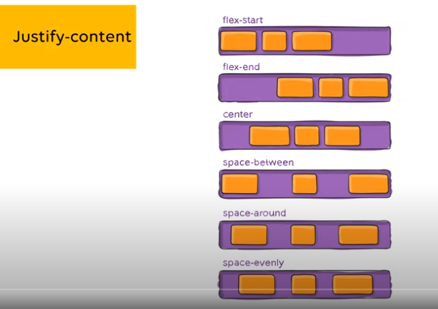
            - it is used to align the content horizontally
        -  align items
            - 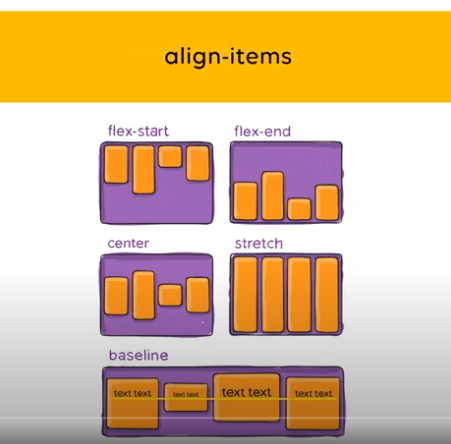
        - align content
            - 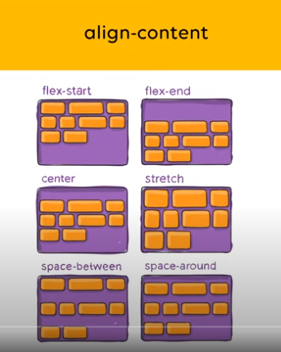
        - align self
            - 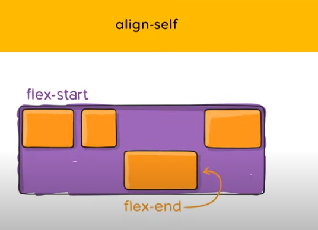

-  this will add 15 div with count
    - `div*15{Box $}`

- https://flexboxfroggy.com/
    - game to learn flex-box

- this will add three li to an ol
    - `ol>li*3`

- type `lorem` and press tab to get the lorem text
    - every time we press tab, we will get a new lorem text
    - the text will not be same, it will be different every time, because it is a random text

- link to shoelace website
    - https://shoelace.komercialize.com.br/

- 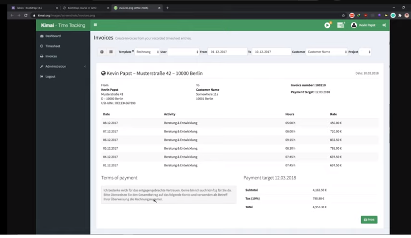
    - try to develop this invoice

- emmet for bootstrap btn
    - `btn.btn.btn-success`

- use `Alt+z` for instant wordwrap